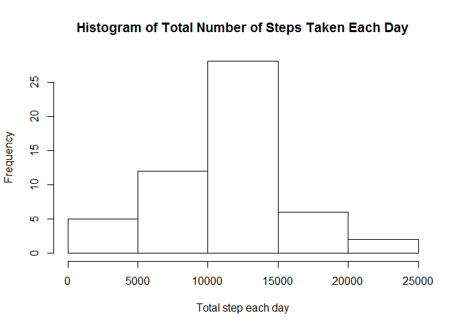
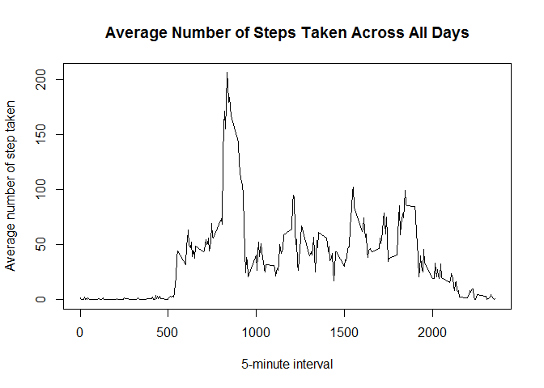
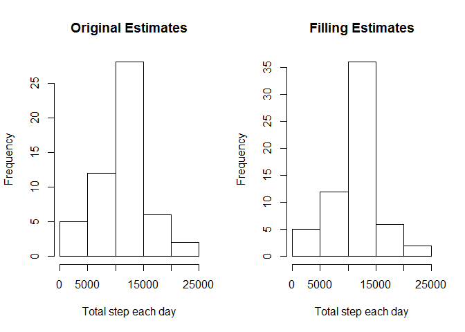
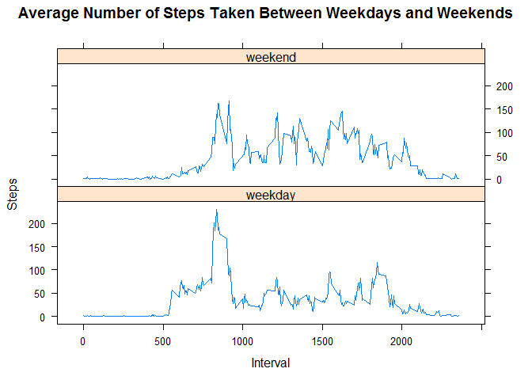

# Reproducible Research: Peer Assessment 1
##Library used in this document

```r
library(lattice)
```

## Loading and preprocessing the data


```r
unzip(zipfile = "activity.zip", overwrite = TRUE)
activity = read.csv2(file = "activity.csv", header = TRUE, sep = ",", colClasses = c("integer", "Date", "integer"))
activity_no_NA = na.omit(activity)
unlink("activity.csv", force = TRUE)
```

- Quick look in variable "activity":

```r
summary(activity)
```

```
##      steps             date               interval     
##  Min.   :  0.00   Min.   :2012-10-01   Min.   :   0.0  
##  1st Qu.:  0.00   1st Qu.:2012-10-16   1st Qu.: 588.8  
##  Median :  0.00   Median :2012-10-31   Median :1177.5  
##  Mean   : 37.38   Mean   :2012-10-31   Mean   :1177.5  
##  3rd Qu.: 12.00   3rd Qu.:2012-11-15   3rd Qu.:1766.2  
##  Max.   :806.00   Max.   :2012-11-30   Max.   :2355.0  
##  NA's   :2304
```

```r
head(activity)
```

```
##   steps       date interval
## 1    NA 2012-10-01        0
## 2    NA 2012-10-01        5
## 3    NA 2012-10-01       10
## 4    NA 2012-10-01       15
## 5    NA 2012-10-01       20
## 6    NA 2012-10-01       25
```

- Quick look in variable "activity_no_NA":

```r
summary(activity_no_NA)
```

```
##      steps             date               interval     
##  Min.   :  0.00   Min.   :2012-10-02   Min.   :   0.0  
##  1st Qu.:  0.00   1st Qu.:2012-10-16   1st Qu.: 588.8  
##  Median :  0.00   Median :2012-10-29   Median :1177.5  
##  Mean   : 37.38   Mean   :2012-10-30   Mean   :1177.5  
##  3rd Qu.: 12.00   3rd Qu.:2012-11-16   3rd Qu.:1766.2  
##  Max.   :806.00   Max.   :2012-11-29   Max.   :2355.0
```

```r
head(activity_no_NA)
```

```
##     steps       date interval
## 289     0 2012-10-02        0
## 290     0 2012-10-02        5
## 291     0 2012-10-02       10
## 292     0 2012-10-02       15
## 293     0 2012-10-02       20
## 294     0 2012-10-02       25
```

## What is mean total number of steps taken per day?

- The total number of steps taken per day: 

```r
total_step_per_day = aggregate(x = activity_no_NA[c("steps", "interval")], FUN = sum, by = list(Group.date = activity_no_NA$date))
head(total_step_per_day)
```

```
##   Group.date steps interval
## 1 2012-10-02   126   339120
## 2 2012-10-03 11352   339120
## 3 2012-10-04 12116   339120
## 4 2012-10-05 13294   339120
## 5 2012-10-06 15420   339120
## 6 2012-10-07 11015   339120
```

- Histogram of the total number of steps taken each day:

```r
hist(total_step_per_day[,2], main = "Histogram of Total Number of Steps Taken Each Day", xlab = "Total step each day")
```

<!-- -->

- Mean and median of the total number of steps taken per day

```r
print("Mean:")
```

```
## [1] "Mean:"
```

```r
mean(total_step_per_day$steps)
```

```
## [1] 10766.19
```

```r
print("Median:")
```

```
## [1] "Median:"
```

```r
median(total_step_per_day$steps)
```

```
## [1] 10765
```

## What is the average daily activity pattern?
- Time series plot  of the 5-minute interval (x-axis) and the average number of steps taken, averaged across all days (y-axis):

```r
average_steps = aggregate(steps~interval, data = activity_no_NA, mean)
head(average_steps)
```

```
##   interval     steps
## 1        0 1.7169811
## 2        5 0.3396226
## 3       10 0.1320755
## 4       15 0.1509434
## 5       20 0.0754717
## 6       25 2.0943396
```

```r
plot(average_steps$interval, average_steps$steps, type="l", main = "Average Number of Steps Taken Across All Days", xlab = "5-minute interval", ylab = "Average number of step taken")
```

<!-- -->


## Imputing missing values
- Total number of rows with NAs:

```r
dim(activity)[1] - dim(activity_no_NA)[1]
```

```
## [1] 2304
```
- Filling in all of the missing values in the dataset using the mean for that 5-minute interval, and create new dataset 'activity_filled' that is equal to the original dataset but with the missing data filled in:

```r
activity_filled <- activity
for(i in 1:dim(activity_filled)[1]){
        if (is.na(activity_filled$steps[i])){
                activity_filled$steps[i] <- average_steps[average_steps$interval == activity_filled$interval[i],2]
        }
}
head(activity_filled)
```

```
##       steps       date interval
## 1 1.7169811 2012-10-01        0
## 2 0.3396226 2012-10-01        5
## 3 0.1320755 2012-10-01       10
## 4 0.1509434 2012-10-01       15
## 5 0.0754717 2012-10-01       20
## 6 2.0943396 2012-10-01       25
```

```r
summary(activity_filled)
```

```
##      steps             date               interval     
##  Min.   :  0.00   Min.   :2012-10-01   Min.   :   0.0  
##  1st Qu.:  0.00   1st Qu.:2012-10-16   1st Qu.: 588.8  
##  Median :  0.00   Median :2012-10-31   Median :1177.5  
##  Mean   : 37.38   Mean   :2012-10-31   Mean   :1177.5  
##  3rd Qu.: 27.00   3rd Qu.:2012-11-15   3rd Qu.:1766.2  
##  Max.   :806.00   Max.   :2012-11-30   Max.   :2355.0
```

- Make a histogram of the total number of steps taken each day and Calculate and report the mean and median total number of steps taken per day:


```r
total_step_per_day_filled = aggregate(x = activity_filled[c("steps", "interval")], FUN = sum, by = list(Group.date = activity_filled$date))
par(mfrow = c(1,2))
hist(total_step_per_day[,2], main = "Original Estimates", xlab = "Total step each day")
hist(total_step_per_day_filled[,2], main = "Filling Estimates", xlab = "Total step each day")
```

<!-- -->


```r
compare_table <- matrix(c(mean(total_step_per_day$steps),
                  median(total_step_per_day$steps),
                  mean(total_step_per_day_filled$steps),
                  median(total_step_per_day_filled$steps)),
                ncol=2,byrow=TRUE)

colnames(compare_table) <- c("Mean","Median")
rownames(compare_table) <- c("Original Estimates","Filling Estimates")
as.table(compare_table)
```

```
##                        Mean   Median
## Original Estimates 10766.19 10765.00
## Filling Estimates  10766.19 10766.19
```

- Do these values differ from the estimates from the first part of the assignment? What is the impact of imputing missing data on the estimates of the total daily number of steps?: This strategy of filling missing value using the mean for that 5-minute interval apparently has no impact on changing the trend of data. However, it make the strong element become stronger and easier to notice.

## Are there differences in activity patterns between weekdays and weekends?


```r
week_data <- activity_filled
week_data$datefactor = factor(ifelse(weekdays(week_data$date) %in% c("Saturday", "Sunday"),"weekend","weekday"))
average_steps_by_weekdays = aggregate(steps~interval + datefactor, data = week_data, mean)
xyplot(average_steps_by_weekdays$steps ~ average_steps_by_weekdays$interval|average_steps_by_weekdays$datefactor, main="Average Number of Steps Taken Between Weekdays and Weekends",xlab="Interval", ylab="Steps",layout=c(1,2), type="l")
```

<!-- -->
